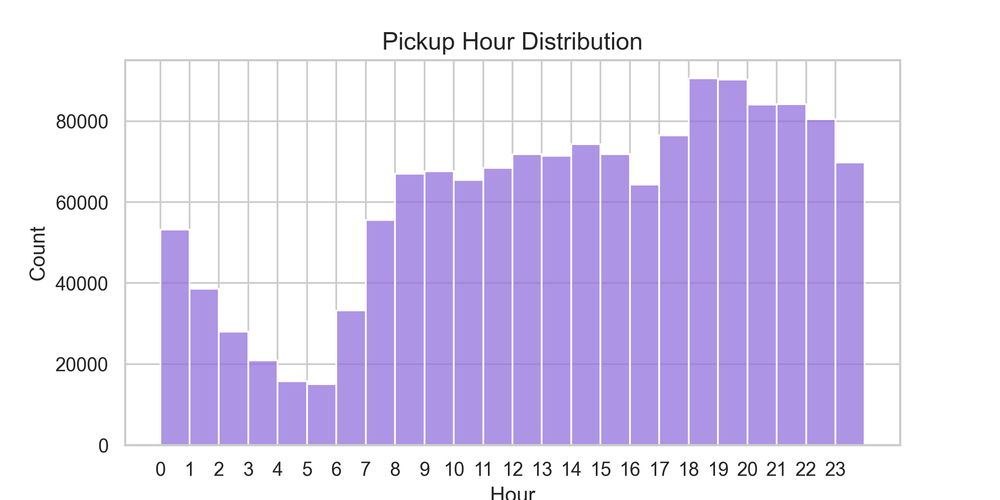
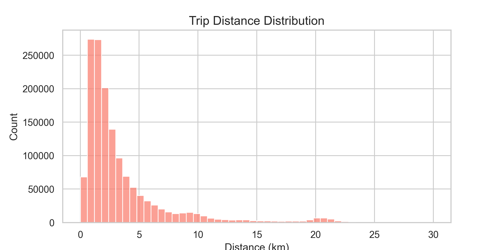
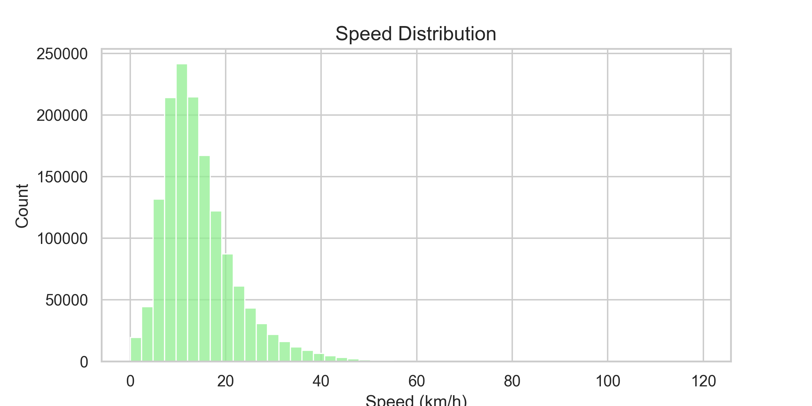
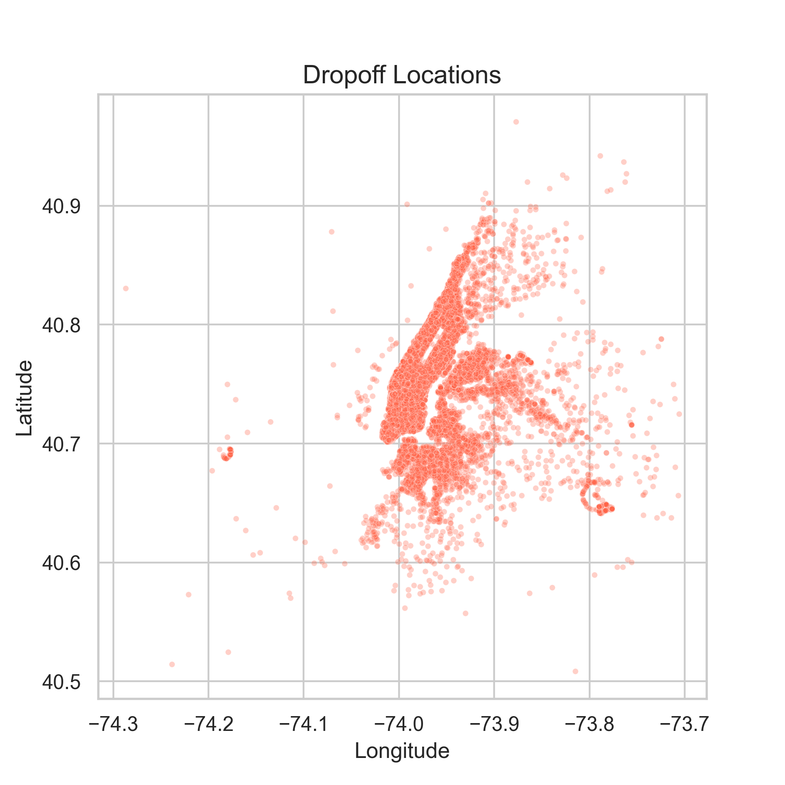
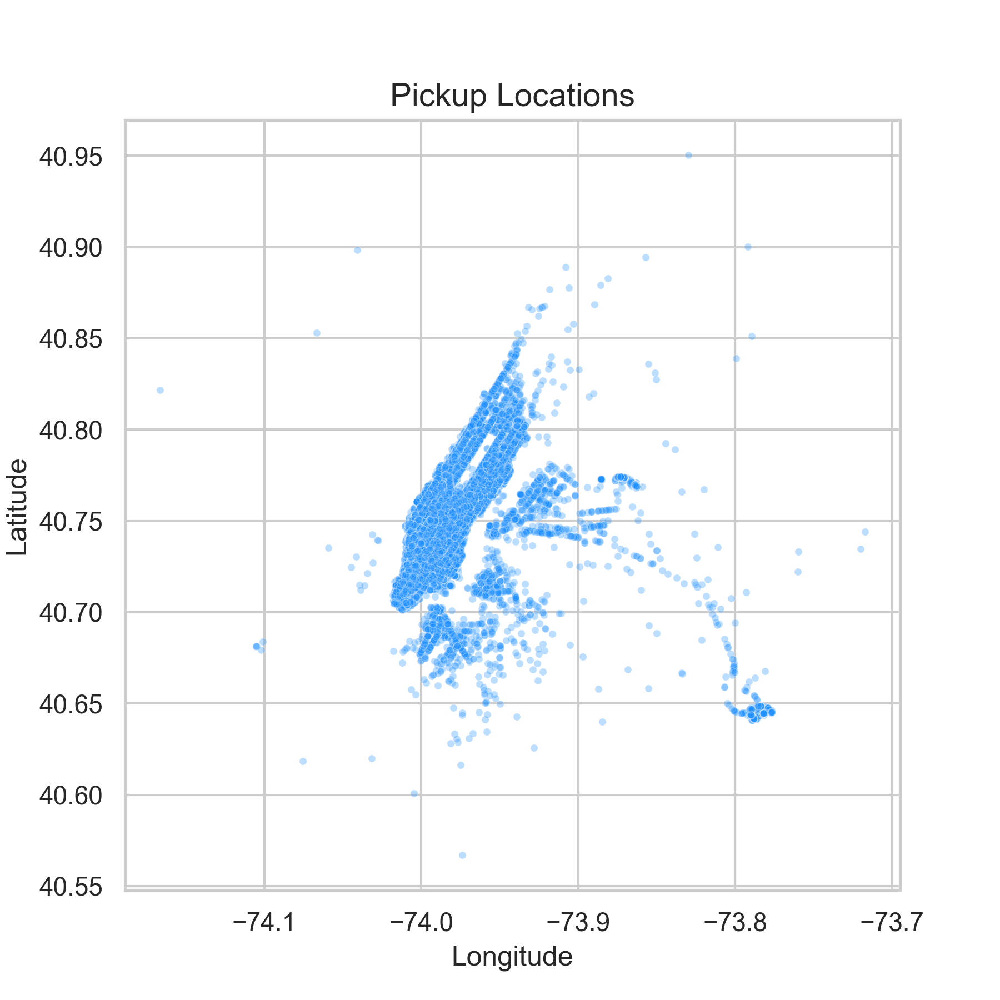
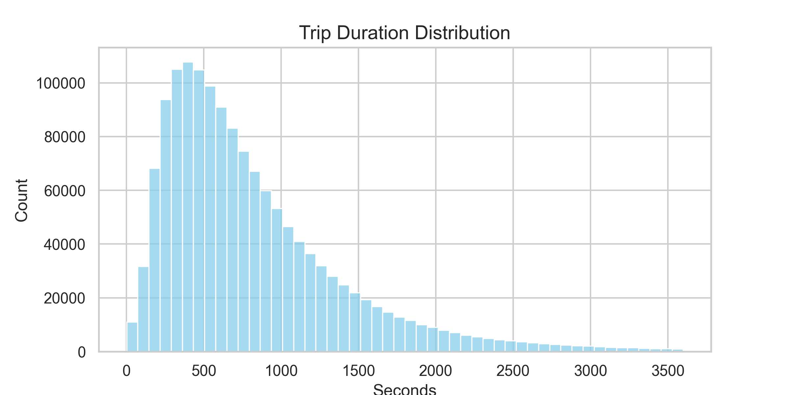
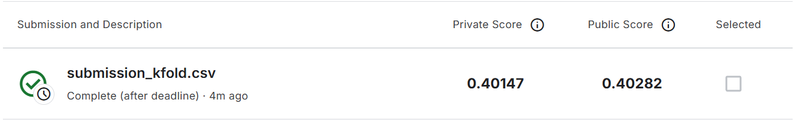

# 东南大学AI作业 - NYC出租车行程时长预测

## 任务描述

**比赛链接**: https://www.kaggle.com/competitions/nyc-taxi-trip-duration/overview

**目标描述**: 根据数据集中的信息(经纬度,开始时间,乘客数量,vendor_id,store_and_fwd_flag),预测出租车所需耗时(目标),训练模型.最终将结果提交至网站上.

**提交链接**: https://www.kaggle.com/competitions/nyc-taxi-trip-duration/submissions

## 数据集特征

原始数据包含以下字段：
- `pickup_datetime`: 上车时间
- `dropoff,datetime`: 下车时间  
- `pickup_longitude/latitude`: 上车经纬度
- `dropoff_longitude/latitude`: 下车经纬度
- `passenger_count`: 乘客数量
- `vendor_id`, 供应商ID
- `store_and_fwd_flag`: 存储转发标志
- `trip_duration`: 行程时长（目标变量）

## 特征工程与数据预处理

### 核心特征提取方法

#### 1. 时间特征提取
```python
df_new["pickup_hour"] = df_new["pickup_datetime"].dt.hour
df_new["month"] = df_new["pickup_datetime"].dt.month
df_new["day_of_week"] = df_new["pickup_datetime"].dt.dayofweek
```
- **基础时间信息**：提取了 `pickup_hour`（小时）、`month`（月份）、`day_of_week`（星期几）。
- **假期特征**：利用day_of_week来捕捉周末和工作日的信息
- **时间模式捕捉**：结合小时和星期信息，模型能够学习到早晚高峰、周末出行等周期性交通规律。



#### 2. 地理特征工程
```python
df_new["distance_km"] = haversine(pickup_lon, pickup_lat, dropoff_lon, dropoff_lat)
```
- 使用**Haversine公式**计算地球表面两点间的最短距离
- 考虑地球曲率的精确地理计算


```python
    a = np.abs(lat2 - lat1) * 111
    b = np.abs(lon2 - lon1) * 85
    return a + b
```
- **曼哈顿距离 (Manhattan Distance)**：针对纽约市棋盘式街道布局，增加了曼哈顿距离特征（利用经纬度每度对应的公里数加权计算），更真实地反映实际行驶路程。

此外还有别的一些辅助操作：
- **方位角 (Bearing/Direction)**：计算从起点到终点的行驶方向，捕捉不同方向（如进出城方向）的交通差异。
- **K-Means 聚类区域特征**：对所有行程的经纬度进行 **K-Means 聚类**（k=100），生成 `pickup_cluster` 和 `dropoff_cluster` 类别特征，将连续的坐标转换为离散的区域 ID，帮助模型识别热点区域（如机场、市中心）。

#### 3. 速度特征衍生
```python
df_new["speed_kmh"] = df_new["distance_km"] / (df_new["trip_duration"] / 3600)
df_new.loc[df_new["speed_kmh"] > 200, "speed_kmh"] = np.nan
```



- 计算平均行驶速度
- 异常值检测与清洗（去除>200km/h的不合理速度）
- 去除离散经纬度地点






#### 4. 行驶时间特征



### 数据预处理流程总结
1. **时间格式转换**: datetime 标准化。
2. **特征生成**: Haversine 距离、曼哈顿距离、方位角、时间特征（含假期）、聚类区域 ID。
3. **清洗**: 基于速度和地理范围过滤异常值。
4. **一致性处理**: 确保训练集和测试集经过完全相同的特征工程处理（特别是聚类模型需在全量坐标上训练）

## 特征分析与建模

### 基线模型：随机森林回归器

初期使用随机森林进行特征重要性筛选：
- **优势**：无需复杂的特征缩放，能直接处理非线性关系。
- **作用**：帮助确认了 `distance_km`、`pickup_latitude` 等特征的重要性，为后续特征工程指明方向。

### 最终模型：LightGBM 回归器

我们选择 LightGBM 作为最终预测模型，并进行了深度优化。

**选择理由**：
1. **高效处理大规模数据**：基于直方图算法，训练速度快，内存占用低，适合百万级数据。
2. **强大的非线性拟合能力**：能够有效组合时间、空间、距离等多维特征。
3. **对类别特征的良好支持**：直接支持聚类 ID 等类别特征的处理。

**优化策略**：
- **参数调优**：
    - 使用了较大的 `num_leaves` (100) 和较小的 `learning_rate` (0.05)，配合更多的迭代次数 (`num_boost_round=5000`)，提升模型拟合能力。
    - 设置 `min_data_in_leaf` 和 `bagging` 参数防止过拟合。
- **K-Fold 交叉验证**：
    - 采用 **5-Fold Cross-Validation** 策略。
    - 训练 5 个模型，每个模型在不同的验证集上评估，最终预测结果取 5 个模型的平均值。
    - **效果**：显著降低了预测方差，提升了模型的泛化能力和稳定性。

### 模型性能与结果

**最终成绩**：
- **验证集 RMSLE**: **0.401** (基于 5-Fold CV 平均)



## 文件结构
```
├── data/
│   └── train.csv              # NYC出租车训练数据
├── utils.py                   # 核心工具函数库
│   ├── haversine()           # 地理距离计算
│   ├── preprocess_copy()     # 数据预处理管道
│   ├── visualize_all()       # 数据可视化套件
│   ├── feature_importance()  # 随机森林特征分析
│   └── plot_importance()     # 特征重要性可视化
├── feature.ipynb             # 特征工程分析notebook
├── test.ipynb               # 模型测试与验证
└── README.md                # 项目文档
```

## 分析工作流

1. **数据加载**：读取训练集与测试集。
2. **特征工程**：
   - 提取时间（含假期）、地理（距离、方向）。
   - **[关键]** 联合训练集和测试集坐标进行 K-Means 聚类，生成区域特征。
3. **数据清洗**：基于统计规则移除异常记录。
4. **模型构建**：配置 LightGBM 回归器，设定优化后的超参数。
5. **交叉验证**：执行 5-Fold CV，评估模型稳定性。
6. **预测与融合**：对测试集进行预测并取平均，生成最终提交文件。

通过引入曼哈顿距离、方位角、聚类特征以及 K-Fold 交叉验证策略，本项目成功构建了一个鲁棒且高精度的出租车行程时长预测模型。

